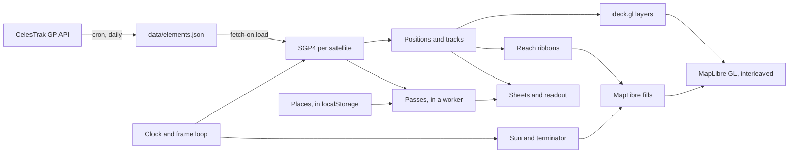
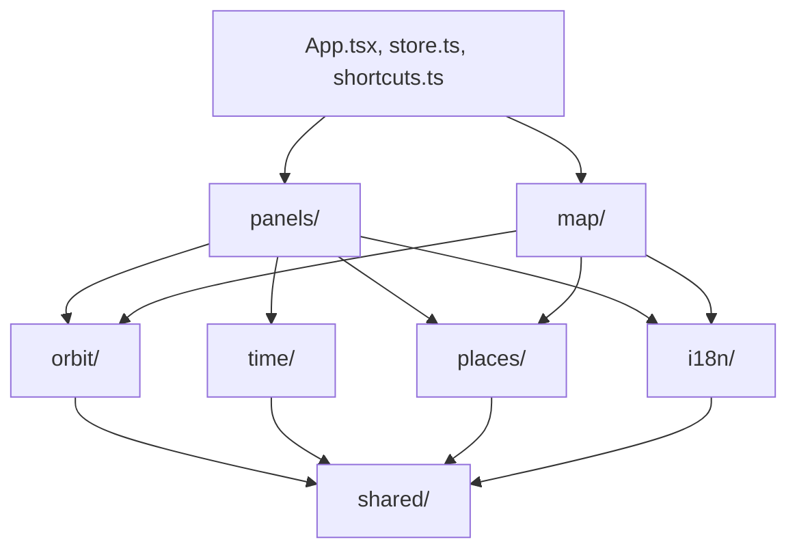

# Architecture

What is going on in nebulosa, for a reader with the code in front of them: the shape of the thing, where the data comes from, and the maths that is not obvious from reading it. It does not walk through the code.

## Overview

A static single-page app with no backend. A cron job on the host fetches the orbital elements of every StriX satellite from CelesTrak into a JSON file next to the site. The browser loads that file, propagates each satellite with SGP4 for whatever moment the clock shows, and draws positions, ground tracks, the day/night terminator, the band a side-looking radar could reach, and passes over pinned places, on a vector basemap that is a globe by default. The only thing stored anywhere is the list of places, in the browser.

## Layout of `src`

Grouped by domain, not by kind of file. Tests sit next to what they test; fixtures live in `test/`.

| Directory | Holds |
| --- | --- |
| `orbit/` | The satellites and the sky: elements, propagation and tracks, passes and their worker, the Sun, the radar's reach, the spherical geometry they share, the readout's figures, human-readable orbit descriptions |
| `time/` | The clock model, its easing, the frame store and the time bar |
| `map/` | MapLibre and deck.gl wiring, the layer builders, the GeoJSON surfaces, the pins, the label lookup that names a place, the basemap language, the zoom that fits |
| `places/` | The place model and its storage |
| `panels/` | The toolbar, the three sheets, the timeline strip, the follow button, the map toggles and the help |
| `i18n/` | The dictionary per language, the hook that serves the chosen one, the place label |
| `shared/` | What several domains use: formatting, the theme and its palettes, the storage helper, the segmented control, small hooks |
| root | `App.tsx` wires the domains over the store; `shortcuts.ts` holds the keyboard scheme and its dispatch, so the legend and the handler cannot drift apart |

Dependencies point inward. Panels and the map use orbit, places, time and shared; time and orbit use only shared; shared uses nothing but a type from orbit.

## State and time

**Two stores.** `store.ts` holds what the reader has chosen: the selection (satellite, ghost, active pass, probe), the pending camera request, whether the map follows, the places and which is selected, the pin lock, the pass filters, the track span, the clock, the theme, the language and the open sheet. Its actions are plain functions, unit-tested without React. `time/frame.ts` holds the two per-frame values, real time and the eased displayed time, written by one animation loop that is handed a function returning the clock, so the time module never imports the store. Only the map, the time bar and the readouts subscribe to it; a minute-rounded selector serves the age displays and the pass computation, so the rest of the tree never re-renders for a frame. Data loading and the passes worker stay in `App.tsx`, which passes lists to prop-driven components.

**The clock** is a pair of anchors and a rate: `sim = anchorSim + (real − anchorReal) × rate`. Rate 1 with a zero offset is live, 10 to 600 is fast-forward. A paused flag freezes the simulated time while keeping the rate, so play resumes at the chosen speed; a pause that began live remembers so, and play returns to live rather than trailing real time by the length of the pause. Scrubbing moves the sim anchor; changing speed re-anchors at the current moment so nothing jumps, and also plays. The slider spans the displayed UTC day; the date picker moves to the chosen date at the same time of day and pauses; Live returns to today.

**Smoothness.** Real time is read every animation frame, and the displayed time eases toward the target with an exponential approach, time constant 120 ms, snapping within a quarter second. A scrub animates rather than cuts, and at 600× the display lags the true time by a constant, invisible ~70 s. The easing loop is registered once and reads its target from a ref; re-registering it per frame canceled the pending step and froze the display, which was a real bug once.

**Cost control.** Positions are recomputed every frame, nine SGP4 evaluations. Tracks are recomputed only when the displayed minute changes and at most every 150 ms of real time, and their segments are rebuilt only when the split between flown and ahead moves to another sample, so deck.gl keeps its geometry between frames. The time bar follows real time at one hertz; the readout's terminator scan is kept until the crossing has passed. Passes are recomputed when the selected place moves or the real minute changes, and are anchored to real time, so scrubbing never changes the list under the reader.

## Data

**Source.** CelesTrak's GP API returns the current mean elements per satellite. The request asks for CCSDS OMM in JSON rather than two-line element sets: TLE has a five-digit catalog number field, the catalog passed 99999 in July 2026, and objects numbered from 100000 up, StriX-9 among them, are absent from TLE output. OMM has no such limit and gives the epoch as an ISO timestamp.

**Refresh.** The elements are not part of the build or the repository. `deploy.sh` publishes a release under the web root and, on first run, fetches the elements once and installs a daily cron line that rewrites `data/elements.json` there; the script writes beside the file and renames over it, so a reader never sees a partial one. nginx serves that path from outside the releases, so deploys never touch it. The app fetches it from its own origin and shows the newest epoch and its age, because accuracy decays with age: roughly a kilometer or two of along-track error per day at 450 to 570 km, more after a maneuver.

**Constellation.** Two orbit families, told apart by inclination: above 80° is sun-synchronous (StriX-1 to -3, about 97.5°, retrograde), the rest mid-inclination (StriX-4 to -9, 38° to 50°). The family only affects color.

## Orbits

**SGP4.** satellite.js turns an OMM record into a `SatRec` and propagates it to a date, giving a position in Earth-centered inertial coordinates. Latitude and longitude need the Earth's rotation angle at that moment, Greenwich mean sidereal time, from the same library. The mean motion in the record is the Kozai value and the propagator's internal one is Brouwer's, slightly different, so the period shown is computed from the record.

**Ground track.** The sub-point sampled every 30 seconds from `pastOrbits` periods before the displayed time to `futureOrbits` after it. Every sample keeps its timestamp, which is what lets hovering a track say when the satellite is there: the nearest sample by distance in degrees, longitude wrapped.

**Antimeridian.** Longitudes stay in −180 to 180, and a path is cut wherever consecutive samples jump across ±180°, ending one piece at the edge and starting the next at the opposite edge with the crossing point on both. deck.gl's own `wrapLongitude` did that on the flat map, but on the globe its grid cutter runs instead and turned such a hop into a ring around the pole.

**Tail and lead.** The flown half of a track is a run of chunks whose opacity falls with age: it drops by half right behind the satellite, so the head has an edge even zoomed in, then eases to its floor within the first 4% of the flown span. The half ahead is one segment at full opacity. One table of alphas serves both themes; a selected satellite keeps its tail well above the dimmed tracks of the others.

**Ghost.** Showing a pass draws a hollow marker where the satellite will be at the peak, labeled with the time and its offset from the displayed moment. If that moment lies beyond the drawn track, the track continues to it as a dashed line, sampled on a grid through the ghost time so the dashes meet the marker.

**Readout.** The selected satellite's row shows where it is at the displayed second: the sub-point and height from the same propagation as the map, the speed as the length of the ECI velocity, the heading as the bearing to the position a second later. The next terminator crossing comes from walking the ground track in 30 s steps for one period and bisecting the first change of daylight to a second; the ground is lit when the Sun is above its horizon, so this is the terminator the map draws, not the satellite's own sunrise some minutes earlier. The next pass is the first in the computed list still to end at the displayed moment. The readout subscribes to the frame store rounded to whole seconds, so only it re-renders that often.

**Timeline.** Under the readout a strip spans the same window as the drawn track, past to the left of the displayed moment and future to the right, with day and night along the ground track sampled per minute and this satellite's passes over the selected place as accent bars. It is an SVG in a 100-by-10 box stretched to the sheet's width, so every x is a percentage of the window. Pointing at it puts the probe at that moment, which the map shows as the hover marker; a double click clears it. The stretches are memoized per displayed minute.

## Terminator

The Sun's position from satellite.js gives right ascension and declination; subtracting Greenwich sidereal time from the right ascension gives the subsolar longitude, and the declination is the subsolar latitude. The terminator is where the Sun sits on the horizon, which along a meridian at longitude λ is at `tan(lat) = −cos(λ − λ_sun) / tan(decl)`. Sampling that per degree of longitude gives a curve; closing it over whichever pole is dark gives the night polygon. Web Mercator has no poles, so the polygon closes at ±85°. Near equinox the curve runs nearly pole to pole; at a solstice it reaches only ±66.6° and one polar cap is entirely in shade.

## Passes and reach

A pass is a period of line-of-sight visibility above the horizon from the selected place, not an imaging opportunity; with no place selected there are none.

**Look angles.** The satellite's inertial position is rotated into Earth-fixed coordinates with sidereal time, then converted to azimuth, elevation and range from the observer.

**Finding passes.** Elevation is sampled every 30 seconds over the horizon of 6 to 48 hours. Each interval above 0° is a pass; its rise and set are refined by bisection to under a second, its peak by a one-second scan around the best sample. The scan starts 20 minutes before the requested start, longer than any low-orbit pass, so a pass already in progress is found from its true rise. The work runs in a web worker; the hook that owns it remembers which place a result was for, so a new place shows no list rather than the old one's.

**SAR reach.** A side-looking radar images a strip beside its track, not the ground under it, so a satellite straight overhead is useless to it. [Synspective's SAR data page](https://www.synspective.com/data/synspective-sar-data/) gives StriX an off-nadir steering range of 15° to 45° and a nominal Stripmap look of 30°; the look side, the swath per acquisition and the tasking are not public. On a sphere, a look θ off nadir from altitude h meets the ground at a central angle `asin((R + h) / R · sin θ) − θ` from the sub-point, about 134 km and 524 km at 500 km altitude for the two limits. The reach layer sweeps those offsets perpendicular to the track heading on both sides, from each sample's own altitude, with geo-coord's great-circle functions on the same equatorial radius, and cuts the ribbons into short polygons handed to the basemap as fills. For a pass, the look angle at the peak follows from the peak elevation e as `asin(R / (R + h) · cos e)`; peaks between roughly 40° and 74° fall inside the range and are marked, and the list can be narrowed to them.

## Rendering

MapLibre GL draws the basemap from OpenFreeMap vector tiles. deck.gl draws the polar discs, tracks, positions, labels, ghost and hover marker through `@deck.gl/maplibre` in interleaved mode, inside MapLibre's own WebGL context and depth buffer. Layer order is discs, tracks, positions, labels, then the ghost's dashed track, marker and label, then the hover marker and label. Tracks, positions, labels and the dashed continuation are pickable with an eight-pixel radius, so a 1.5-pixel line can be tapped; the hovered point is unprojected by MapLibre from the pointer pixel, since the coordinate deck picks is wrong on the globe, and a picked layer may arrive without an object, which the hover handler must tolerate or it takes the render loop down.

**Sharing a context.** Three things are easy to get wrong. MapLibre creates its context without multisampling, since its own lines are antialiased in the shader, so deck's paths would render jagged unless the map asks for multisampling. MapLibre 6 loads its web worker from a file next to its own script, which a bundled app does not have, so the worker is bundled explicitly and registered at startup. And MapLibre's control layer has a z-index of 2; the HTML panels must sit above it or the map paints over their text.

**Shaded surfaces.** The night side and the reach band are MapLibre fill layers on GeoJSON sources, updated when the displayed minute changes: the basemap tessellates them onto its own globe, hides the far side itself, and shares no render state with anything. Two source settings matter: no tile buffer, or a fill touching the antimeridian is wrapped into world copies that overlap there in a band twice as dark, and no simplification, or the reach's small quads drift into a ladder of overlaps and gaps. The fills go without antialiasing, as the style's own water does, so the two halves of the night meet at the antimeridian without a hairline. MapLibre's fills live in Mercator tiles, which end at 85°; beyond that the basemap has no data and draws a fan that picks up whatever color touches it, so the two polar caps are deck.gl discs in a neutral gray, honest holes, built from 36 cells each because the globe renderer only draws pieces narrower than half the world correctly.

An earlier round drew both surfaces in deck.gl and spent days on what that costs: deck cuts globe polygons into 10° cells that sag into the basemap's sphere, no lift survives the limb, hiding the far side by hand lags the camera, and deck's render state leaks into MapLibre's cached GL state and makes it draw its own far-side tiles as dark wedges. MapLibre's state cache is marked dirty after every frame as insurance.

**Globe.** MapLibre owns the projection; the deck.gl overlay notices and swaps its own view, so tracks and picking carry over, and the far side is hidden by depth. Labels skip both the depth test and back-face culling, because a depth-tested billboard is cut by the sphere near the limb and half the labels face away from the camera; far-side labels are dropped instead, judged by whether MapLibre's own project and unproject round-trip a point back to itself. deck.gl's geometry floats 30 km above the ground in globe mode only, since a chord between two samples otherwise sinks in and out of the basemap's faceted sphere and reads as dashes; the lift is a model matrix applied after tessellation, because a third coordinate confuses the grid cutter. On the flat map the lift is zero and deck's depth test is off, since nothing needs hiding and the test only made tracks z-fight with the ground at high zoom. The globe yields to the flat map past zoom 5.5: curvature is invisible in a view that narrow, and the deck.gl MapLibre module clips its globe view away a little beyond that. The projection lives in the style, so it is applied when the style has loaded, on every toggle, and on every zoom.

**Follow.** With a satellite selected, the map recenters on it every frame, on the globe by turning the planet under it. Any gesture of the reader's own lets go, a drag, a wheel or pinch zoom, a rotation or a tilt, told apart from the app's own camera moves by the original event MapLibre attaches; the zoom buttons keep the center and keep following. Following pauses while a pointer is down, because a recenter between mouse-down and the first movement would cancel the drag MapLibre is about to start, and the wheel lets go on the wheel event itself, because the zoom it queues for the next frame would be discarded by a recenter before that frame. A gesture marks the let-go before the store hears of it, so the frame in between does not recenter either, and the flight to a freshly selected satellite happens once per selection and not at all while following.

**Resize.** Up to luma.gl 9.4.0 the overlay drifted after a window resize, offset vertically by exactly the height change: luma kept a framebuffer object for the canvas whose height set the y-flip of every viewport drawn into it, and its deferred resize refreshed that object only when luma itself had to change the canvas size, which MapLibre had already done. The map view resized that object itself on the map's resize event until the fix, visgl/luma.gl#3178 against issue #3177, shipped in 9.4.1, which the lockfile now carries; deck re-measures through luma's ResizeObserver and MapLibre's move event drops the cached viewport, so nothing of the app's own is needed.

**Fit and padding.** The initial zoom is computed from the container: the globe takes 85% of the shorter side, the flat world 85% of the width, so a phone and a large monitor both open on the whole Earth. The toolbar and the time bar float over the foot of the map, so the app measures where the toolbar sits and hands the map that height as bottom padding: the camera centers, and the fit is taken, in the area above the bars, while the map keeps drawing under them.

**Bundling.** The map view is loaded lazily, and MapLibre and deck.gl are built into chunks of their own so a deploy that touches only app code leaves them cached. satellite.js ships an optional WASM propagator whose Emscripten glue targets Node; the app never loads it, and the build aliases its two entry points away so they stay out of the module graph.

**Theme.** Light and dark are one set of CSS custom properties on the root, the light values under `[data-theme=light]`; the choice is stored in the browser, and with no choice the system preference decides. The same colors exist a second time as numbers in `shared/theme.ts`, because deck.gl and MapLibre cannot read a custom property: the family colors, the page and panel colors for labels, the neutral gray of the caps, the pins, the hover dot, the night paint and the basemap URL, fiord for dark and positron for light. A theme change swaps the basemap with `setStyle`, handing the new style the current projection through the style transform, because a style without one comes up in Mercator until the load handler restores the globe, and Mercator meanwhile forces the camera to fit the world, which near the poles shrank the globe on every change; the style.load handler that adds the fills then runs again with the new paints. The light palette darkens the family colors and the accent so hairline tracks and yellow text survive a white ground: the accent reads 5:1 on the page and the sun-synchronous track 3.4:1 on the basemap's water, above the WCAG floors of 4.5:1 for small text and 3:1 for graphics; the dark theme clears both by a wide margin.

**Languages.** Every visible word comes from one dictionary per language behind a single typed shape, English and Japanese, so a missing or differently typed entry is a compile error and a test compares the two shapes. Components take the dictionary from a hook; formatting helpers that produce words take it as a parameter, defaulting to English so the pure tests read as before; the layer builder takes it as an option for the labels' offsets. Layout never changes with the language: satellite names, catalog numbers, units and UTC times stay as they are, and the system font stack covers the Japanese glyphs. The language follows the browser until the picker chooses, the choice is stored like the theme's, and the document's `lang` attribute follows. So does the basemap: the tiles carry a name per language, so on each style load and language change every symbol layer that shows a name is pointed at that language's, with the Latin form and then the local name as fallbacks, and a new place takes its name from the same field.

## The seat

The view from a satellite is a second MapLibre map over the first, not a mode of it: a globe with no deck.gl, its interactions off, the night and reach fills and the own track as its own GeoJSON layers updated per minute, torn down on the way back so the main map is exactly as it was. Each frame the camera is placed with MapLibre's camera-from-position helper at the satellite's sub-point, height and heading, turned by the yaw and pitch the reader has dragged; the field of view is fixed, since zooming from a seat read as odd. Three things about that helper matter. Before MapLibre 6.9 it returned a `roll` key set to `undefined`, which the jump read as a number and filled the transform's matrices with NaN, after which every camera call on that map failed; the fix, treating an option given as `undefined` as not given, went upstream from here, and the app requires 6.9. It must not run before the style has loaded, or the transform has no matrices to compute with. And MapLibre defines a camera by the ground point it looks at, in Mercator coordinates, which end at 85°: a satellite at 82° pitched 60° looks past the pole, the point is clamped, and the camera comes apart. So when the look-at point would pass 84° the pitch is bisected down to the value that puts it exactly on the line and released on the other side, a continuous dip of a minute or so; stepping it snapped the heading, since meridians converge fast up there. The pitch is otherwise capped at the starting 60°, where the horizon sits near the top, because MapLibre's globe gets odd with more sky than ground, and the vector source's tile zoom is capped at 6, coarser than the height would pick, so fewer tiles stream past the camera at speed; the cap sits on the source rather than the map, since a map zoom cap held the camera up at nadir, where the helper needs a higher zoom than at the horizon. The time bar stacks above the view so the clock stays at hand.

## Places

Several pins, one selected or none, kept in the browser's `localStorage` and seeded with Tokyo. A double click, or a long press on a touch screen, drops one where the pointer is, and coordinates typed into the places sheet in any common shape go through geo-coord's parser. A typed place is selected and flown to at zoom 7, and once the map has settled there it is named after the nearest settlement label the same way a dropped pin is, keeping its coordinates when no settlement is in reach rather than taking the country's name. A dropped pin is named after the nearest settlement label the basemap is showing within 60 px, else the nearest country label, else its coordinates. The names come from the tiles already on screen, so no service is asked and no coordinates leave the browser. Passes are computed for the selected place only.

Pins are MapLibre HTML markers, which the globe does not occlude; a covered pin is made fully transparent and loses its pointer events each frame, or it could be grabbed through the planet and dragged to the near side. A lock in the places sheet makes every pin undraggable, for the phone in a pocket and the careless mouse; it is kept with the places.

The located place is the one exception to dragging. It is added or moved from the browser's Geolocation API when the reader presses the row that stands in for it at the end of the places list, never on load, and refreshed from its own row. It is drawn as a target rather than a pin, is never draggable whatever the lock says, and there is only ever one, under a fixed id. Its label is fixed too, "My location" in the reader's language, since the place has no name of its own.

## Layout

A toolbar of pills sits above the time bar, one per list, and each pill shows what is chosen in its list while the list is closed: the satellite's name and family swatch, the selected place's label, the active pass and its peak time. Tapping a pill opens that list as a sheet above the toolbar, one at a time; the sheet grows upward as far as the top of the map, and its list scrolls. While something is chosen the pill grows a second side behind a thin divider, a × that clears that choice without opening anything, and every sheet has a × in its corner, since the pill that opened it is not an obvious way back.

On desktop the satellites sheet is open at the start and choosing something leaves it open, since there is room. On viewports up to 720 px wide the map comes first: no sheet is open at the start, the sheet is capped at just over half the screen, and choosing a satellite, a place or a pass closes it, so the screen goes back to the map with the choice still readable on the pill. The pill row scrolls sideways when the three do not fit, and the map area clips whatever its floating bars cannot fit, so the page itself never scrolls. The map toggles live in the title row on every screen: a globe or flat-map icon, a sun or moon for the theme, `SAR`, and the language picker. The compass sits top right, the follow button under it on a phone and above the help button bottom right on a desktop. There is no footer and MapLibre's attribution control is not used: an ⓘ button in the corner, under the help on a desktop and above the bars on a phone, opens a panel in the app's own style with the disclaimer, the data and map credits (OpenFreeMap, OpenMapTiles, OpenStreetMap), the libraries, a link to the source and the copyright, in the reader's language; Esc closes it first of all.

## Testing

Pure modules, orbit, passes, sun, swath, clock, format, describe, are unit-tested against StriX-1 and StriX-9 elements and hand-computed values. Components are tested with React Testing Library; MapLibre and deck.gl are mocked, since jsdom has no WebGL, and the deck.gl layer builders are tested by inspecting the layer props and calling their accessors. What the mocks cannot see runs in a real browser: a Playwright suite in `e2e/` drives the built app in headless Chromium, with the clock fixed at the fixture's epoch, the elements served from the fixture and the basemap's tile, glyph and sprite requests answered empty, so only the style itself comes from outside. It boots the app and fails on any page error, selects and follows a satellite and lets go on a real drag, lists and shows passes, walks the keyboard scheme, flips the projection, theme and language and reloads to see them kept, places the located pin from a granted geolocation and fails to drag it, and on a phone viewport checks that one sheet is open at a time and the page never scrolls. It runs in CI after the build. For a look rather than an assertion there is `scripts/screenshot.mjs`, which drives headless Chrome over the DevTools protocol against a local server or the deployed site, can act on the page and sweep the pointer across the map first, and reports page exceptions. Every milestone's capture is kept under `docs/screenshots`.
