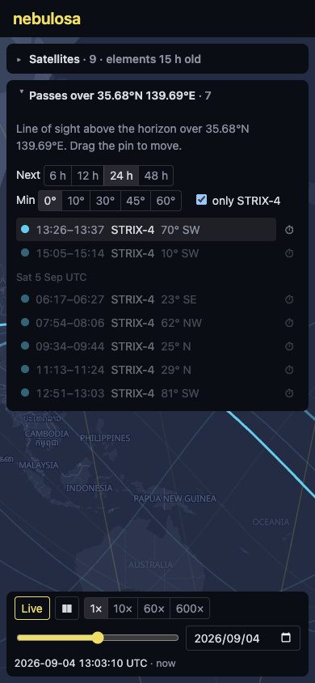

# nebulosa

Owls see in the dark. So does SAR.

Ground-track visualizer for the Synspective StriX SAR constellation, built from public orbital data (CelesTrak GP, in OMM form). Named for *Strix nebulosa*, the great grey owl: same genus as the satellites, the iconic owl of Finland, and Latin for "cloudy", so an owl named *cloudy* for satellites built to see through clouds.

Unofficial demo project; not affiliated with Synspective.

Live at [nebulosa.misaki.fi](https://nebulosa.misaki.fi). [SCOPE.md](SCOPE.md) is the plan it was built from; [ARCHITECTURE.md](ARCHITECTURE.md) explains how it works and the maths behind it.




Earlier captures, one per milestone, are kept in [docs/screenshots](docs/screenshots/README.md).

## What it shows

- Every StriX satellite's current position and ground track, propagated with SGP4 from the latest mean elements, colored by orbit family: sun-synchronous in yellow, mid-inclination in cyan. The flown part of a track fades behind the satellite, so the direction of travel is readable at a glance.
- A clock: live, paused, or playing at up to 600×, with a slider over ±12 hours and a date picker. Positions, tracks and the day/night terminator follow it.
- Hover a track to see when the satellite is at that point. Tap a satellite, its label, its track, or its row in the list to select it; the list shows launch, orbit, altitude, period, eccentricity and element epoch, and the rest dims.
- Passes over a location: drag the pin, and the panel lists every line-of-sight pass over the next 6 to 48 hours with rise, set and peak elevation, filterable by minimum elevation and to the selected satellite. Show a pass to see where the satellite will be at its peak, or jump the clock to it.
- SAR reach: the band of ground 15° to 45° off nadir on either side of the selected satellite's track, and per pass, the look angle at the peak and whether it is inside that range. A satellite straight overhead cannot image the pin; one that peaks at 40° to 74° can.
- The element epoch and its age are always visible, because stale elements mean degraded accuracy.

Passes are geometric visibility above the horizon, not imaging opportunities. What the radar could reach is drawn from the one public figure, Synspective's stated 15° to 45° off-nadir steering range: selecting a satellite shades that band on both sides of its track, until the `SAR reach` toggle (or `R`) hides it, and a pass whose peak falls inside it is marked in the list, with an `in SAR reach` filter. Which side the antenna looks, the swath actually chosen and the tasking are not public, so nothing here claims to be an imaging opportunity.

## Data

The orbital elements come from the CelesTrak GP API as CCSDS OMM in JSON, not TLE: the satellite catalog passed 99999 in July 2026, and objects numbered from 100000 up, StriX-9 among them, never appear in the fixed-width TLE format. Nothing is committed to this repository; a cron job on the host refreshes `data/elements.json` daily, and the app loads it from its own origin. As of September 2026 the constellation has nine satellites in orbit: StriX-1 to -3 in roughly 97.5° sun-synchronous orbits, StriX-4 to -9 at 38° to 50°.

## Develop

```sh
npm install
npm run elements # fetch public/data/elements.json from CelesTrak (not committed; do this first)
npm run dev      # Vite dev server
npm test         # Vitest
npm run lint     # oxlint
```

Stack: React, TypeScript and Vite; satellite.js for SGP4; deck.gl over a MapLibre GL basemap with OpenFreeMap tiles; Vitest and React Testing Library. `scripts/screenshot.mjs` captures the site with headless Chrome over the DevTools protocol and reports page errors, with options to act on the page first, sweep the pointer across the map, and pick a viewport size.

## Deploy

Static files behind nginx over HTTPS (Let's Encrypt / certbot). The web root is owned by the deploying user, so nothing needs root after the one-time setup:

```sh
sudo install -d -o "$USER" -g "$USER" /var/www/nebulosa
```

[`deploy.sh`](deploy.sh) pulls, builds, copies the result to `releases/<sha>` under the web root, and points the `current` symlink at it; the last three releases are kept. The web root is asked on first run and saved to `.deploy.local`.

```sh
./deploy.sh                          # pull, build, publish
./deploy.sh --no-pull                # build the working tree as-is
WEBROOT=/some/other/path ./deploy.sh # override the web root
```

The orbital elements are not part of a release. A daily cron job fetches them into `data/` under the web root, which nginx serves at `/data/`; the first deploy fetches them once to get started and installs that job in the deploying user's crontab.

[`nginx.conf.example`](nginx.conf.example) is the server block it's served from.

## License

MIT. Orbital data from [CelesTrak](https://celestrak.org/). Map tiles from [OpenFreeMap](https://openfreemap.org/), © OpenStreetMap contributors.
