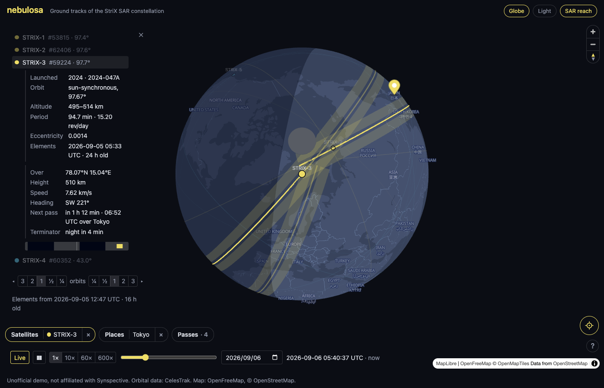
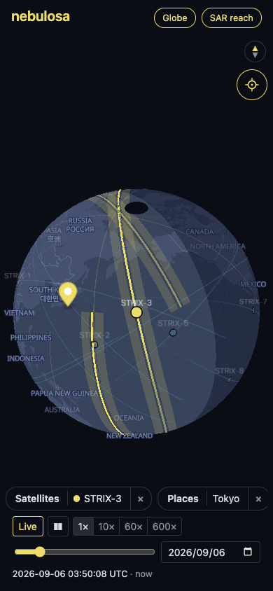

# nebulosa

Owls see in the dark. So does SAR.

Ground-track visualizer for the Synspective StriX SAR constellation, built from public orbital data (CelesTrak GP, in OMM form). Named for *Strix nebulosa*, the great gray owl: same genus as the satellites, the iconic owl of Finland, and Latin for "cloudy", so an owl named *cloudy* for satellites built to see through clouds.

Unofficial demo project; not affiliated with Synspective.

Live at [nebulosa.misaki.fi](https://nebulosa.misaki.fi). [SCOPE.md](SCOPE.md) is the plan it was built from; [ARCHITECTURE.md](ARCHITECTURE.md) explains how it works and the maths behind it.





Every capture, one per milestone and the light theme beside the dark, is shown in [docs/screenshots](docs/screenshots/README.md).

## What you see

**The satellites.** Every StriX satellite where it is now, with its ground track one orbit back and one ahead, propagated with SGP4 from the latest mean elements. Color is orbit family: sun-synchronous in yellow, mid-inclination in cyan, amber and blue on the light theme. The flown part of a track dims right behind the satellite and fades further back, so the direction of travel reads at a glance. The element epoch and its age are always visible, because stale elements mean degraded accuracy.

**The sky.** The day/night terminator shaded over the ground, and a globe by default, flat Mercator on request; the far side is hidden, so a mid-inclination orbit and the terminator read as shapes. The basemap has no data beyond 85°, so the poles are blank discs.

**Places and passes.** Pins on the ground, one selected at a time, and for that one every line-of-sight pass over the next 6 to 48 hours: rise, set, peak elevation and direction. Beside the selected satellite's track, the band of ground its radar can reach, 15° to 45° off nadir on either side, and per pass whether the peak falls inside it.

**The clock.** Live, paused, or playing at up to 600×, with a slider over the displayed day and a date picker. Positions, tracks, the terminator, the readout and the timeline all follow the displayed moment.

Passes are geometric visibility above the horizon, not imaging opportunities. What the radar could reach is drawn from the one public figure, Synspective's stated 15° to 45° off-nadir steering range. Which side the antenna looks, the swath actually chosen and the tasking are not public, so nothing here claims to be an imaging opportunity: a satellite straight overhead cannot image the pin, one that peaks at 40° to 74° could.

## Using it

**Selecting.** Tap a satellite, its label, its track, or its row in the satellites sheet; the rest dims. The sheet then shows launch, orbit, altitude, period, eccentricity and element epoch, a readout of where the satellite is at the displayed moment, its height, speed, heading, next pass over the selected place and next terminator crossing, and a strip of its track with day and night and the passes along it. Hover a track for the time at that point; point at the strip, or use `← →`, to probe a moment.

**Following.** With a satellite selected the map keeps it centered as time plays, on the globe by turning the planet. Any gesture of your own, a drag, a wheel, a pinch, lets go; `F` or the round button on the map turns it back on.

**From the seat.** With a satellite selected, the button under its readout, or `V`, puts the camera on it: its own globe, looking along the heading from the satellite's height, the horizon across the top, the reach band beside the track and the night ahead or behind. Drag to look around, straight down to a little below the horizon. The time bar stays at the foot, so the clock can be scrubbed or played from the seat; at high speed the ground streams in behind the camera. The back arrow or `Esc` returns to the map as it was.

**Places.** Double-click the map, or press and hold on a phone, to drop a pin named after the nearest place label on the basemap. Drag a pin to move it, or lock all pins against stray drags. In the places sheet, rename, reorder with `Shift ↑ ↓`, or remove; the last row places a pin at the browser's own location, only when asked, drawn as a target and moved only from its own refresh. Places stay in the browser and go nowhere else.

**Passes.** The passes sheet lists the passes over the selected place, grouped by day, with a filter for the hours ahead and for the passes the radar can steer to; `O` narrows it to the selected satellite. Show a pass to mark where the satellite will be at its peak, or go to it (`⏎`) to move the clock there as well. Hover a time range for its distance from the displayed moment, and a peak's angle for its look angle off nadir.

**Time.** The bar at the foot: live, play/pause (`Space`), speed, the slider over the displayed UTC day, and the date. A pause taken live resumes live; `L` returns to live from anywhere.

**Sheets and toolbar.** Three pills, satellites, places and passes, each showing what is chosen in it and opening its sheet with `1`, `2`, `3` or a tap; `↑ ↓` step through the open one. While something is chosen the pill has a × that clears it, and every sheet has its own ×. On a phone one sheet is open at a time and choosing something closes it. `Esc` peels the selection back a layer at a time: pass, then place, then satellite.

**Toggles.** In the title row: globe or flat map (`G`), light or dark (`T`, following the system until chosen), `SAR` reach on or off (`R`), and the language, English or Japanese, following the browser until chosen; every word changes, the basemap's labels included. `?` lists every key.

## Data

The orbital elements come from the CelesTrak GP API as CCSDS OMM in JSON, not TLE: the satellite catalog passed 99999 in July 2026, and objects numbered from 100000 up, StriX-9 among them, never appear in the fixed-width TLE format. Nothing is committed to this repository; a cron job on the host refreshes `data/elements.json` daily, and the app loads it from its own origin. As of September 2026 the constellation has nine satellites in orbit: StriX-1 to -3 in roughly 97.5° sun-synchronous orbits, StriX-4 to -9 at 38° to 50°.

## Develop

```sh
npm install
npm run elements # fetch public/data/elements.json from CelesTrak (not committed; do this first)
npm run dev      # Vite dev server
npm test         # Vitest
npm run test:e2e # Playwright, in headless Chromium against the built app
npm run lint     # oxlint
```

Stack: React, TypeScript and Vite; zustand for state; CSS Modules; satellite.js for SGP4; deck.gl interleaved into a MapLibre GL basemap with OpenFreeMap tiles; Vitest and React Testing Library for the unit and component tests, Playwright for the browser tests in `e2e/`. `scripts/screenshot.mjs` captures the site with headless Chrome over the DevTools protocol and reports page errors, with options to act on the page first, sweep the pointer across the map, and pick a viewport size.

## Deploy

Static files behind nginx over HTTPS (Let's Encrypt / certbot). The web root is owned by the deploying user, so nothing needs root after the one-time setup:

```sh
sudo install -d -o "$USER" -g "$USER" /var/www/nebulosa
```

[`deploy.sh`](deploy.sh) pulls, builds, copies the result to `releases/<sha>` under the web root, and points the `current` symlink at it; the last three releases are kept. The web root is asked on first run and saved to `.deploy.local`.

```sh
./deploy.sh                          # pull, build, publish
./deploy.sh --no-pull                # build the working tree as-is
WEBROOT=/some/other/path ./deploy.sh # override the web root
```

The orbital elements are not part of a release. A daily cron job fetches them into `data/` under the web root, which nginx serves at `/data/`; the first deploy fetches them once to get started and installs that job in the deploying user's crontab. The fetch writes beside the file and renames over it, so readers see the old file or the new one, never a partial one.

[`nginx.conf.example`](nginx.conf.example) is the server block it's served from.

## License

MIT. Orbital data from [CelesTrak](https://celestrak.org/). Map tiles from [OpenFreeMap](https://openfreemap.org/), © OpenStreetMap contributors.
