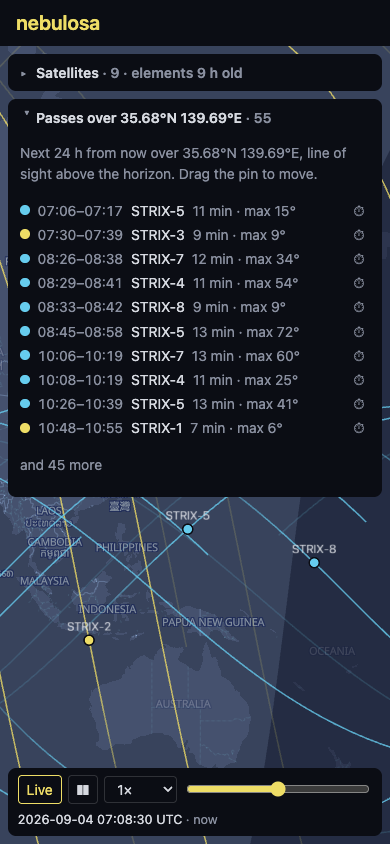

# nebulosa

Owls see in the dark. So does SAR.

Ground-track visualizer for the Synspective StriX SAR constellation, built from public
orbital data (CelesTrak GP, in OMM form). Named for *Strix nebulosa*, the great grey owl — same genus
as the satellites, the iconic owl of Finland, and Latin for "cloudy": an owl named
*cloudy*, for satellites built to see through clouds.

Unofficial demo project; not affiliated with Synspective.

See [SCOPE.md](SCOPE.md) for the plan. Live at [nebulosa.misaki.fi](https://nebulosa.misaki.fi).




Earlier captures, one per milestone, are kept in [docs/screenshots](docs/screenshots/README.md).

## Develop

```sh
npm install
npm run elements # fetch public/data/elements.json from CelesTrak (not committed; do this first)
npm run dev      # Vite dev server
npm test         # Vitest
npm run lint     # oxlint
```

## Deploy

Static files behind nginx over HTTPS (Let's Encrypt / certbot). The web root is owned by the
deploying user, so nothing needs root after the one-time setup:

```sh
sudo install -d -o "$USER" -g "$USER" /var/www/nebulosa
```

[`deploy.sh`](deploy.sh) pulls, builds, copies the result to `releases/<sha>` under the web
root, and points the `current` symlink at it; the last three releases are kept. The web root
is asked on first run and saved to `.deploy.local`.

```sh
./deploy.sh                          # pull, build, publish
./deploy.sh --no-pull                # build the working tree as-is
WEBROOT=/some/other/path ./deploy.sh # override the web root
```

The orbital elements are not part of a release. A daily cron job fetches them into `data/`
under the web root, which nginx serves at `/data/`; the first deploy fetches them once to get
started and installs that job in the deploying user's crontab.

[`nginx.conf.example`](nginx.conf.example) is the server block it's served from.

## License

MIT. Orbital data from [CelesTrak](https://celestrak.org/).
