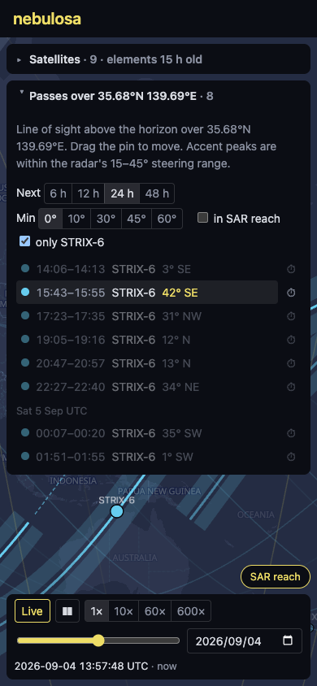
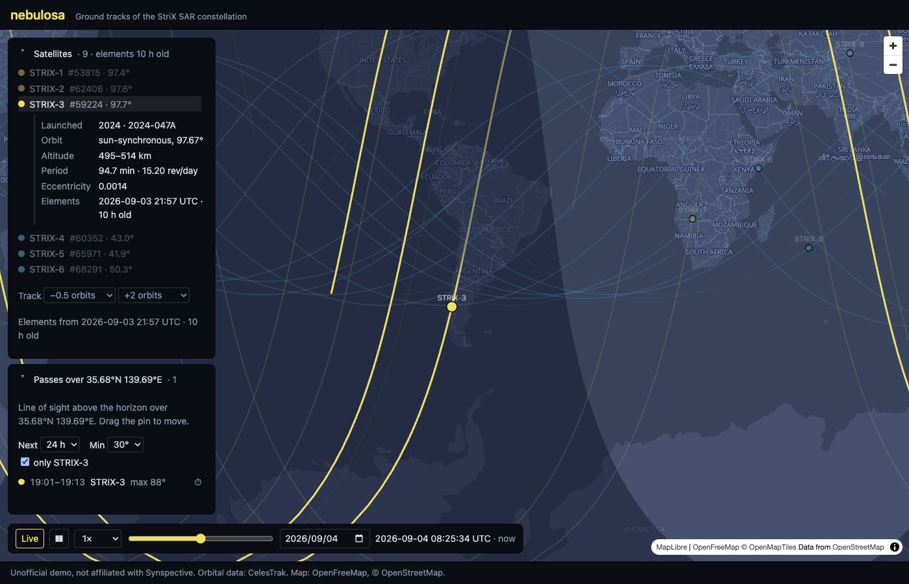
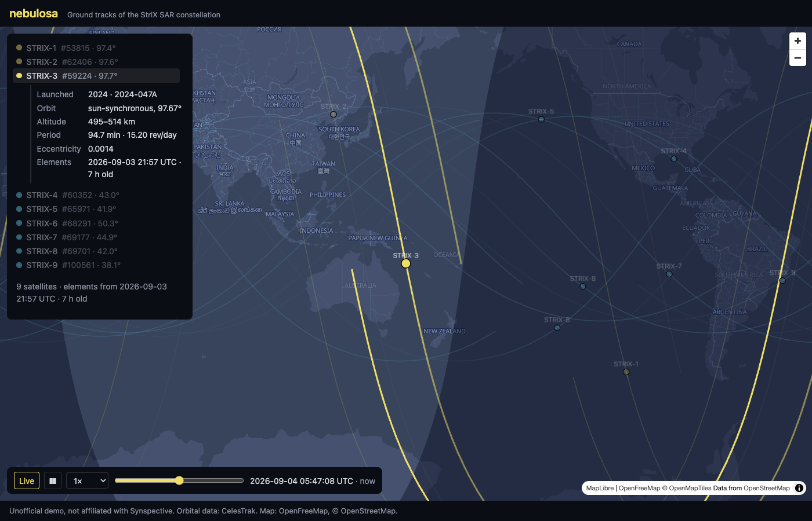

# Screenshots

One capture per milestone, taken from the deployed site with [`scripts/screenshot.mjs`](../../scripts/screenshot.mjs), newest first. The README shows the latest pair; the rest stay here as a record of how the site grew.

## 2026-09-05 · Globe

The map opens as a globe: MapLibre's globe projection with deck.gl interleaved into it, the far side hidden. STRIX-3 selected with its details, its reach band beside the track, the pass list filtered to it and to 30° or higher, the one pass shown with the satellite ghosted at its peak; the Globe and SAR reach pills bottom-right.

The same on a phone (390×844): the pass list filtered to STRIX-8, peaks inside the steering range in the accent color, one pass shown, the globe below.

## 2026-09-04 · SAR reach

The reach band on by default beside the selected satellite's track: 15° to 45° off nadir on both sides, computed from each sample's own altitude, with the gap under the track that a side-looking radar cannot image. STRIX-3 selected with its details, the pass list filtered to it and to 30° or higher, the one pass shown with the satellite ghosted at its peak; the `SAR reach` toggle bottom-right.

The same on a phone (390×844): the pass list filtered to the selected satellite, peaks inside the steering range in the accent color, the `in SAR reach` filter beside the others, one pass shown and the rest dimmed.

## 2026-09-04 · Segmented controls

Segmented controls replace the dropdowns: the track span as a timeline around the unit, the pass filters, the speed. STRIX-3 selected with its details, the pass list filtered to it and to 30° or higher, the one pass shown with the satellite ghosted at its peak.

The same on a phone (390×844): the pass list open, filtered to the selected satellite, one pass shown and the rest dimmed, day headers between UTC dates.

## 2026-09-04 · M6

Settings in use: a half-orbit tail and two-orbit lead, passes filtered to 30° and to the selected satellite, the date picker in the time bar; both panels in one left column with fixed headers and scrolling lists.

## 2026-09-04 · M5 on a phone

390×844: the two panels docked as collapsible bars, passes opened and scrolling, the map still visible, the time bar wrapped across the bottom.

## 2026-09-04 · M4

Observer pin over Tokyo, the next 24 h of passes across the constellation, one pass picked with the clock paused at its peak and the map centered on the satellite.

## 2026-09-04 · M3

A selected satellite with its details inline (launch, orbit, altitude, period, eccentricity, element epoch), the map centered on it, the rest dimmed.

## 2026-09-04 · M2

Time controls (live, play/pause, speed, ±12 h slider), day/night terminator, tracks fading behind each satellite, fiord basemap.

## 2026-09-04 · M1

Nine StriX satellites with ±1-orbit ground tracks on a dark basemap, colored by orbit family; panel with NORAD IDs, inclinations and element epoch age.
