# Screenshots

One capture per milestone, taken from the deployed site with [`scripts/screenshot.mjs`](../../scripts/screenshot.mjs), newest first. The files carry a running number so they sort in order, then a name for what they show; the headings carry the dates. The README shows the latest desktop and phone captures in the dark theme; the rest stay here as a record of how the site grew.

## 2026-09-08 · Credits

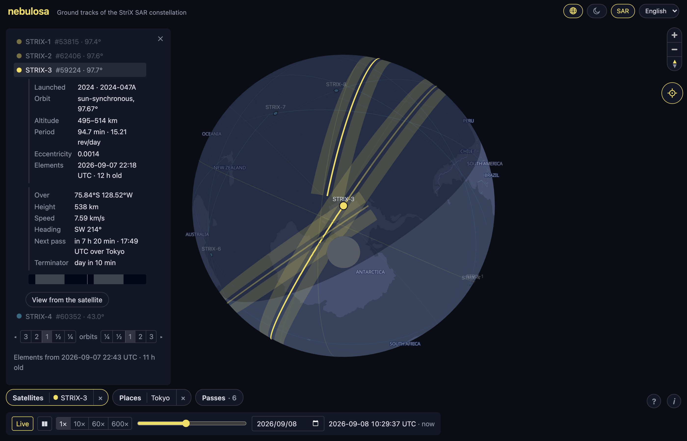

The site after the footer went: the map runs to the foot of the page, and the corner holds two round buttons, the keyboard legend and the credits. STRIX-3 selected over Antarctica with its reach bands, the readout and the timeline strip, the Tokyo pin on the far side; the follow button now sits under the map controls on every screen.

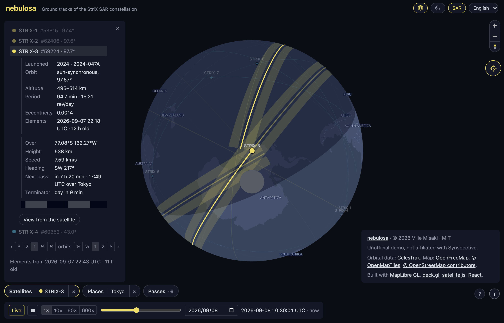

The ⓘ opened: the name as the link to the source and the copyright, the disclaimer, the data and map credits, the libraries, in a panel of the app's own style above its button. Esc or the button closes it.

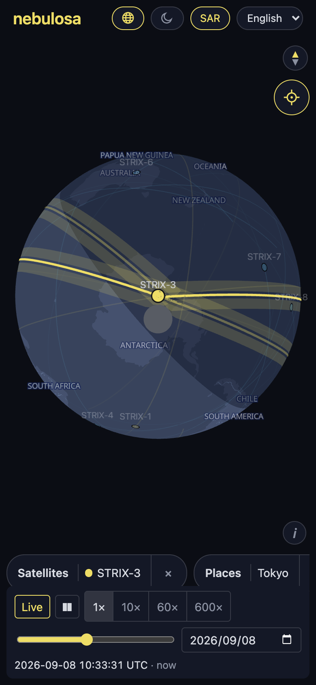

The same on a phone (390×844): the sheet closed after the selection, the satellite followed, the ⓘ above the pill row and the legend gone, since a touch screen has no keyboard to speak of.

## 2026-09-08 · The seat

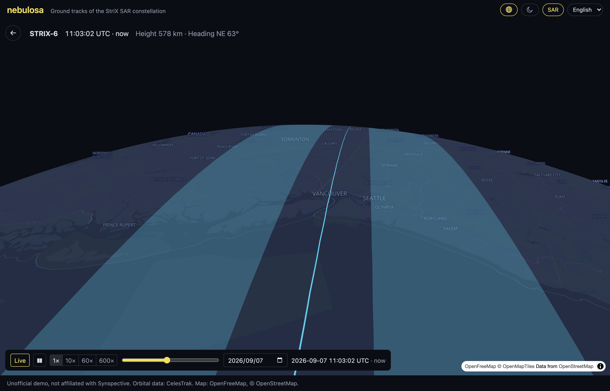

The view from STRIX-6: the camera at the satellite's height and heading on a globe of its own, the horizon across the top, the own track running ahead and the reach band on both sides of it with the gap of unreachable ground under the track, coming in over Vancouver and Seattle on the night side. The HUD gives the time and its offset, the height and the heading; the time bar stays at the foot; the arrow or Esc returns to the map as it was. Dragging turns the view from straight down to a little below the horizon.

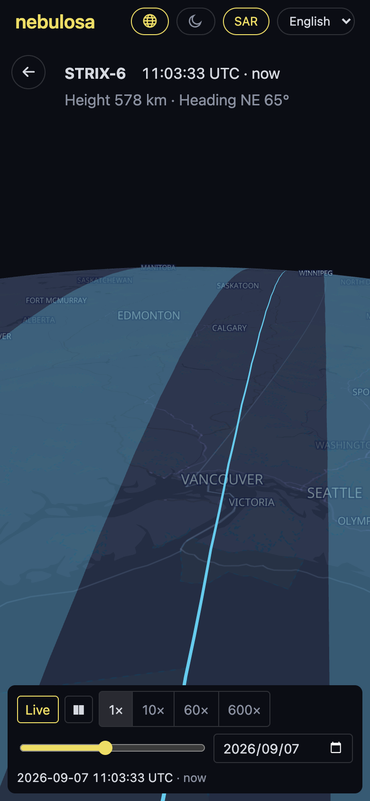

The same on a phone (390×844) half a minute later, the HUD wrapped under the title row.

## 2026-09-06 · Japanese

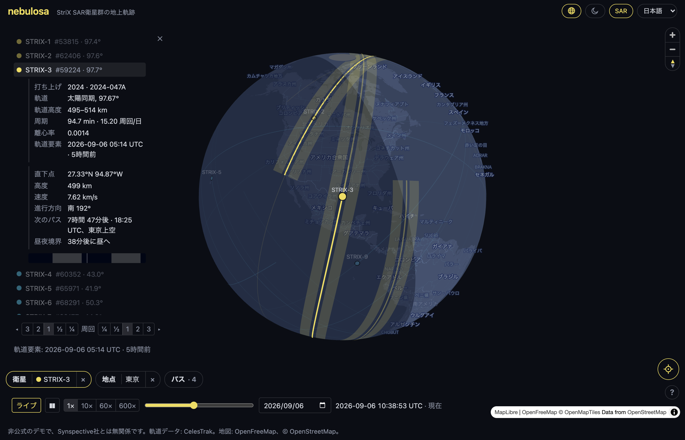

The interface in Japanese: the picker in the title row chose 日本語, and every word followed, the basemap's labels included, since the tiles carry a name per language. STRIX-3 selected over the Gulf of Mexico with its details and readout, the next pass over 東京, the pin renamed in the places sheet. Satellite names, catalog numbers, units and UTC times stay as they are.

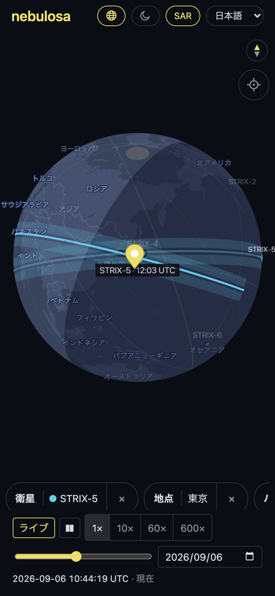

The same on a phone (390×844): a STRIX-5 pass over 東京 shown from the passes sheet, which closed to hand the screen back to the map, the satellite ghosted at the pass's peak with its time, the pills in Japanese.

## 2026-09-06 · Theme

Dark, the default when the system is: fiord basemap, yellow and cyan tracks. STRIX-3 selected near the north cap with its readout and timeline strip, its reach band, the Tokyo pin, and the polish from the review round: two-sided pills, the sheet's close button, the follow button under the corner.

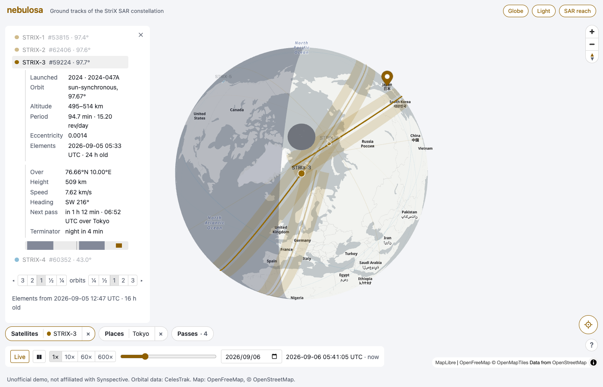

The same view in light: positron basemap, the tracks in amber and blue, the accent deepened so text and hairlines clear the contrast guidelines, the cap a neutral gray in both.

## 2026-09-06 · Focused satellite

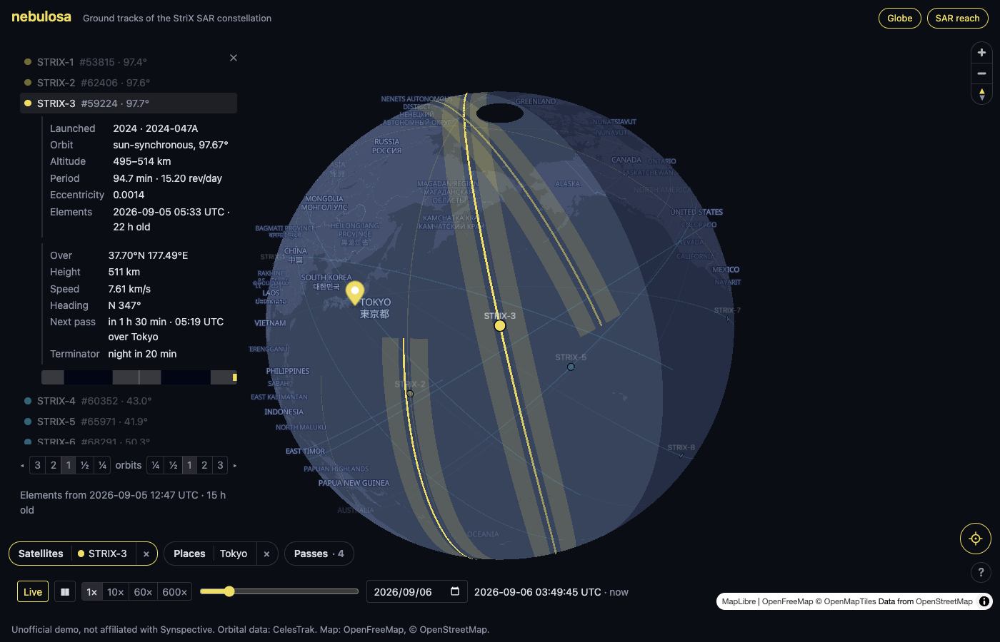

STRIX-3 selected and followed: under its details a live readout of where it is, its height, speed and heading, its next pass over Tokyo and its next terminator crossing, then a strip of the drawn track with day and night along it. The round button at the right keeps the map on it; any gesture of the reader's own lets go. Each pill clears its choice from a × behind a divider, the sheet has a × of its own, and the map toggles sit in the title row.

The same on a phone (390×844): the satellite followed on the globe, the follow button lit under the compass, the toggles in the title row, the pill row scrolling sideways, the sheet closed after the selection.

## 2026-09-05 · Globe

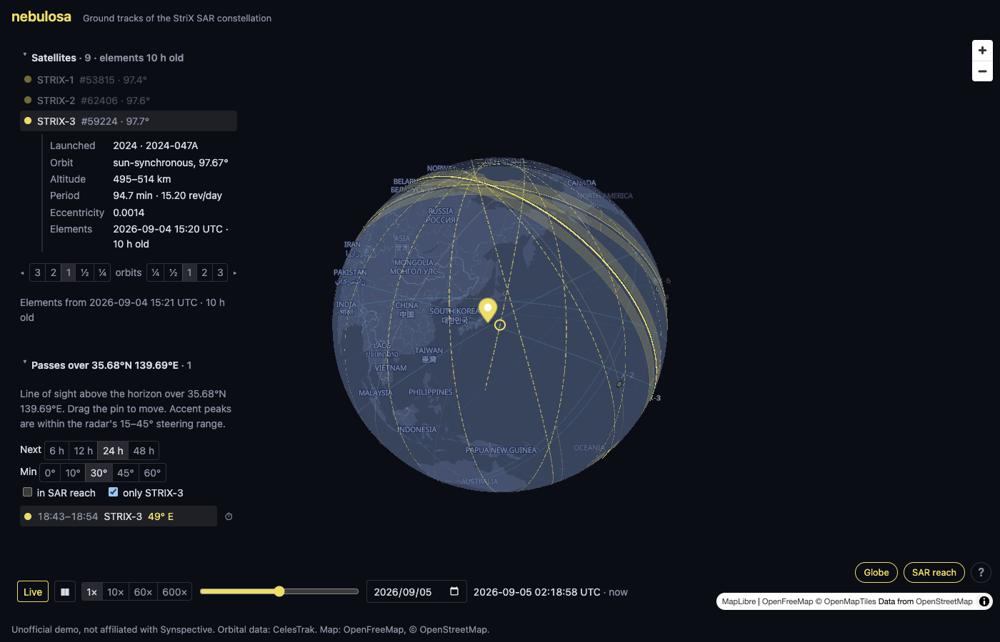

The map opens as a globe: MapLibre's globe projection with deck.gl interleaved into it, the far side hidden. STRIX-3 selected with its details, its reach band beside the track, the pass list filtered to it and to 30° or higher, the one pass shown with the satellite ghosted at its peak; the Globe and SAR reach pills bottom-right.

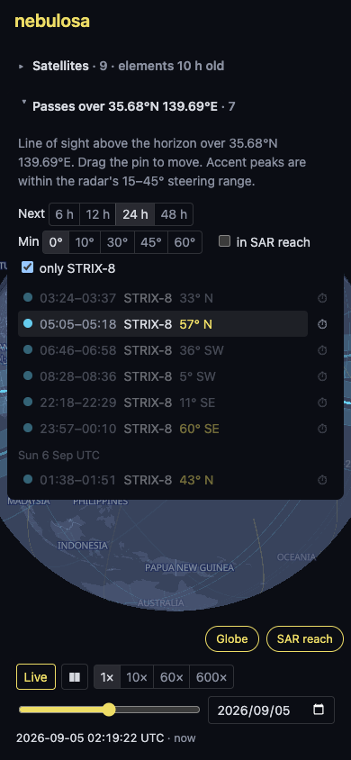

The same on a phone (390×844): the pass list filtered to STRIX-8, peaks inside the steering range in the accent color, one pass shown, the globe below.

## 2026-09-04 · SAR reach

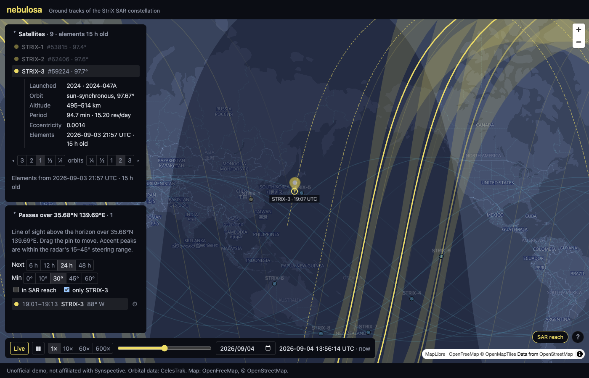

The reach band on by default beside the selected satellite's track: 15° to 45° off nadir on both sides, computed from each sample's own altitude, with the gap under the track that a side-looking radar cannot image. STRIX-3 selected with its details, the pass list filtered to it and to 30° or higher, the one pass shown with the satellite ghosted at its peak; the `SAR reach` toggle bottom-right.

The same on a phone (390×844): the pass list filtered to the selected satellite, peaks inside the steering range in the accent color, the `in SAR reach` choice beside the others, one pass shown and the rest dimmed.

## 2026-09-04 · Segmented controls

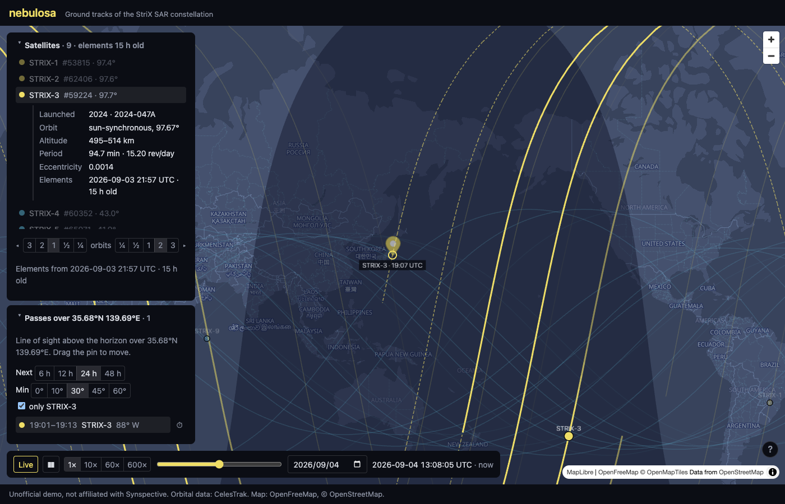

Segmented controls replace the dropdowns: the track span as a timeline around the unit, the pass filters, the speed. STRIX-3 selected with its details, the pass list filtered to it and to 30° or higher, the one pass shown with the satellite ghosted at its peak.

The same on a phone (390×844): the pass list open, filtered to the selected satellite, one pass shown and the rest dimmed, day headers between UTC dates.

## 2026-09-04 · M6

Settings in use: a half-orbit tail and two-orbit lead, passes filtered to 30° and to the selected satellite, the date picker in the time bar; both panels in one left column with fixed headers and scrolling lists.

## 2026-09-04 · M5 on a phone

390×844: the two panels docked as collapsible bars, passes opened and scrolling, the map still visible, the time bar wrapped across the bottom.

## 2026-09-04 · M4

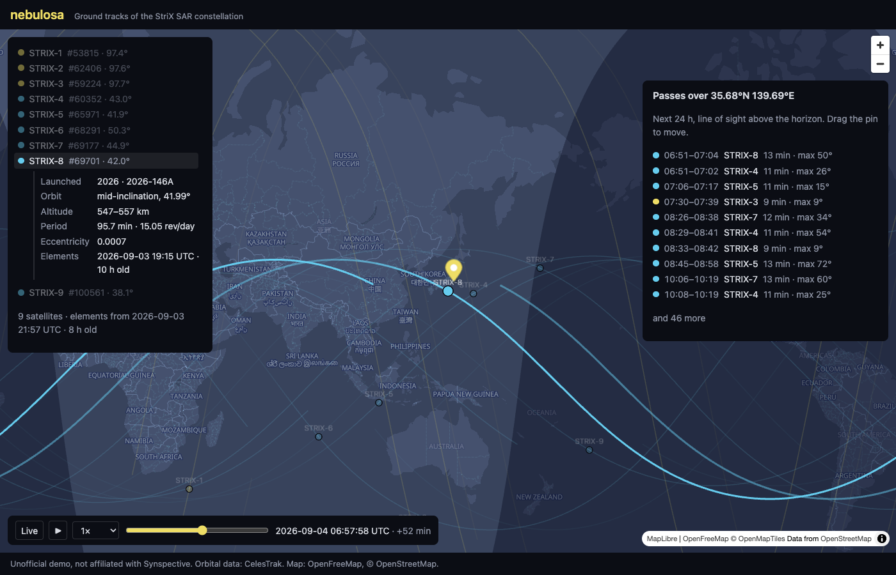

Observer pin over Tokyo, the next 24 h of passes across the constellation, one pass picked with the clock paused at its peak and the map centered on the satellite.

## 2026-09-04 · M3

A selected satellite with its details inline (launch, orbit, altitude, period, eccentricity, element epoch), the map centered on it, the rest dimmed.

## 2026-09-04 · M2

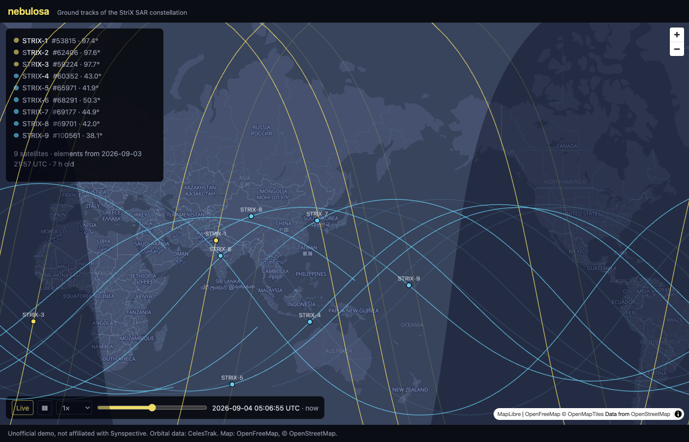

Time controls (live, play/pause, speed, time-of-day slider), day/night terminator, tracks fading behind each satellite, fiord basemap.

## 2026-09-04 · M1

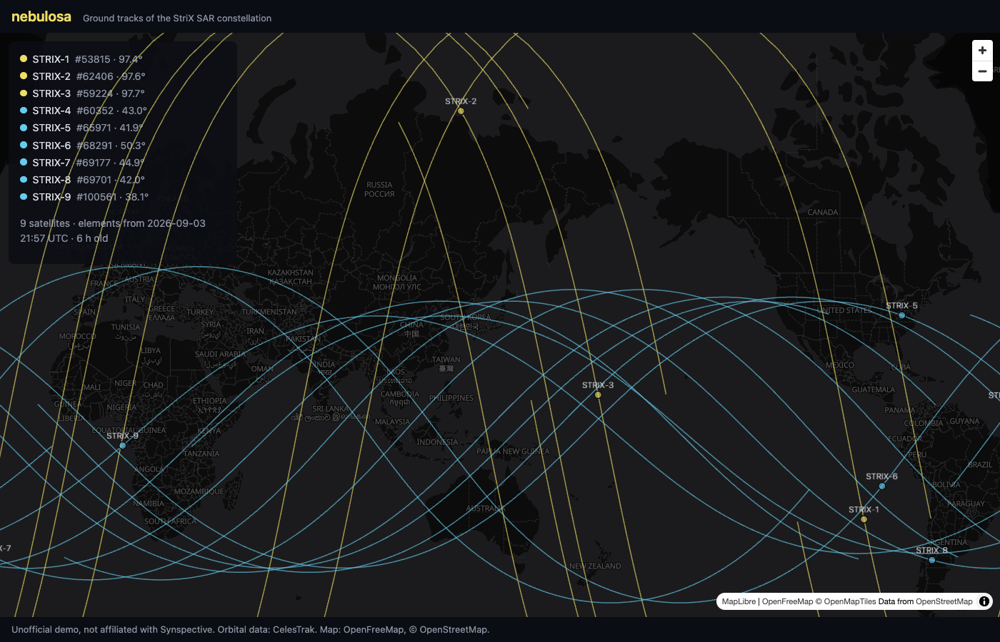

Nine StriX satellites with ±1-orbit ground tracks on a dark basemap, colored by orbit family; panel with NORAD IDs, inclinations and element epoch age.
